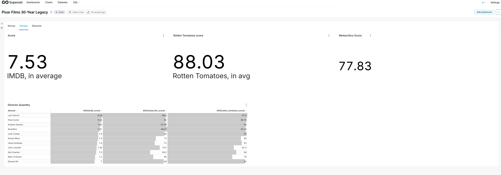

# Maven Pixar Challenge

## Setup
1. Install dbt mysql
pip install dbt-mysql

2. Init project 
dbt init Maven_Pixar_Challenge

3. update content file 
./dbt_project.yml
./profiles.yml

4. dun "dbt debug" for testing config & connection

5. Extract
run "dbt seed" to seed all file csv to mysql database
6. Transform & Load
run "dbt run"

## Visualization
1. Superset Dashboard

